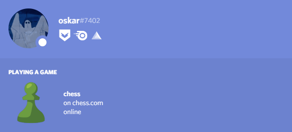
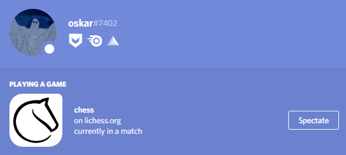

# chesscord

Chesscord displays your chess activity as discord rich-presence!

## currently supported websites:

- lichess.org
- chess.com

## Image examples

### online

### playing

## to notice:

- rich presence can only be updated every 15th second
- only other discord users are able to press the spectate button on your profile
- if you are online on multiple platforms, then the order is:
  - lichess.org > chess.com
- chess.com playing activity is not working yet!
